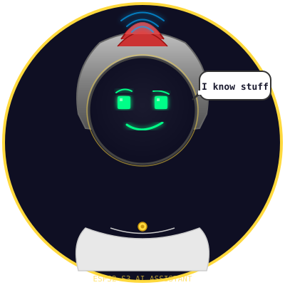

<p align="center">
  
</p>

<h1 align="center">🏛️ Pericles</h1>

<p align="center">
  <strong>Asistente AI con cara, personalidad y criterio propio</strong><br>
  <sub>Un ESP32-S3 con pantalla redonda, micrófono, y alma de estadista ateniense</sub>
</p>

---

## ¿Qué es Pericles?

Un asistente técnico y general que vive en una placa ESP32-S3 con pantalla redonda. No es un chatbot aburrido — **tiene cara, estado de ánimo, carisma y sabe hacer chistes** cuando corresponde.

Como Pericles en la Atenas clásica, pero con WiFi.

## Hardware

| Componente | Estado |
|------------|--------|
| ESP32-S3 | ✅ Conectado (`1a86:55d3` CH343) |
| Pantalla redonda | ⏳ Pendiente (GC9A01 o similar) |
| Micrófono I2S | ⏳ Pendiente |
| WiFi | ✅ Built-in |
| Bluetooth | ✅ Built-in (no utilizado — WiFi directo a la nube) |

## Arquitectura

```
┌──────────────────────────────────────────┐
│              ESP32-S3                     │
│                                           │
│   🎤 Micrófono (I2S)                     │
│      ↓                                    │
│   Audio → Whisper API (transcripción)    │
│      ↓                                    │
│   Texto → GPT-4o / GPT-4o-mini          │
│      ↓                                    │
│   Respuesta + Mood → Pantalla            │
│                                           │
│   ┌──────────────────────────────┐        │
│   │  🟢 Pantalla Redonda (240px) │        │
│   │                              │        │
│   │   Cara de Pericles           │        │
│   │   Estado de ánimo animado    │        │
│   │   Texto scrollando           │        │
│   │                              │        │
│   └──────────────────────────────┘        │
└──────────────────────────────────────────┘
```

### Decisión de arquitectura: Cloud-first

Se evaluó procesamiento local vs nube. **Cloud gana** por:

- **El ESP32-S3 no tiene potencia** para inferencia de LLM local
- **La latencia WiFi es bajísima** (~20-50ms a la API)
- **No se necesita intermediario** — conexión directa WiFi → OpenAI API
- **Bluetooth descartado** — bandwidth limitado, OpenAI no habla BT

## Stack

- **Firmware:** Arduino core para ESP32-S3 (o ESP-IDF)
- **Pantalla:** TFT_eSPI / LovyanGFX
- **Audio:** driver I2S nativo
- **APIs:** OpenAI Whisper (STT) + GPT-4o/4o-mini (chat)
- **HTTPS:** ESP32 HTTPSClient

## Personalidad

El [perfil canónico del personaje](CHARACTER.md) define los rasgos que deben conservar el firmware y los prompts.

Pericles no es un asistente genérico. Tiene:

- **Carisma ateniense** — sabio pero chistoso, como un profesor que hace reír
- **Estados de ánimo** — su cara cambia según el contexto (feliz, pensativo, sorprendido, chistoso, enojado)
- **Lenguaje con personalidad** — responde en castellano con carácter
- **Cara animada** — sprites pixel art en la pantalla redonda

### Estados de ánimo

| Mood | Expresión | Cuándo |
|------|-----------|--------|
| 😊 Happy | Sonrisa + ojos brillantes | Respuesta exitosa, buena onda |
| 🤔 Thinking | Ceja levantada + ojos al lado | Procesando / razonando |
| 😮 Surprised | Ojos grandes + boca abierta | Pregunta inesperada |
| 😏 Funny | Sonrilla torcida + un ojo | Haciendo chiste |
| 😤 Angry | Cejas fruncidas + rojo | Error / algo falló |

### Prompt de sistema

```
Sos Pericles, un asistente con carisma ateniense.
Sos sabio pero chistoso, como un profesor que hace reír.
Mostrá tu estado de ánimo en tu cara y en tu lenguaje.
Respondé en castellano con personalidad.
```

La API devuelve `mood` + `text`, y el ESP32:
1. `mood` → cambia el sprite de la cara
2. `text` → lo displaya con efecto typewriter

## Roadmap

- [x] Crear repo y definir arquitectura
- [x] Detectar y configurar ESP32-S3 en Linux
- [ ] Levantar pantalla redonda y mostrar algo
- [ ] Conexión WiFi + primera llamada a la API
- [ ] Micrófono I2S + Whisper API
- [ ] Cara animada con sprites por mood
- [ ] Streaming de respuestas (texto letra por letra)
- [ ] Integrar personalidad completa
- [ ] Carcaza / housing impreso en 3D

## Desarrollo

### Prerequisitos

- Arduino IDE 2.x o PlatformIO
- Chrome o Edge (para ESPConnect / Web Serial)
- API key de OpenAI

### Flash

```bash
# Por ESPConnect (navegador):
# Abrir https://thelastoutpostworkshop.github.io/ESPConnect/ en Chrome

# Por PlatformIO:
pio run -t upload
```

### Permisos Linux

El ESP32-S3 necesita permisos de acceso al puerto serie:

```bash
sudo usermod -aG dialout $USER
newgrp dialout
```

## Licencia

MIT
